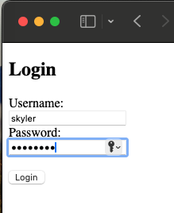

# Python-App

##How to Install Flask
'''bash
cd Python-App
python3 -m venv .venv
. .venv/bin/activate
pip3 install Flask
'''
##How to build project

'''bash
cd flask-tutorial
flask --app hello run
flask --app flaskr run --debug --host=0.0.0.0
'''